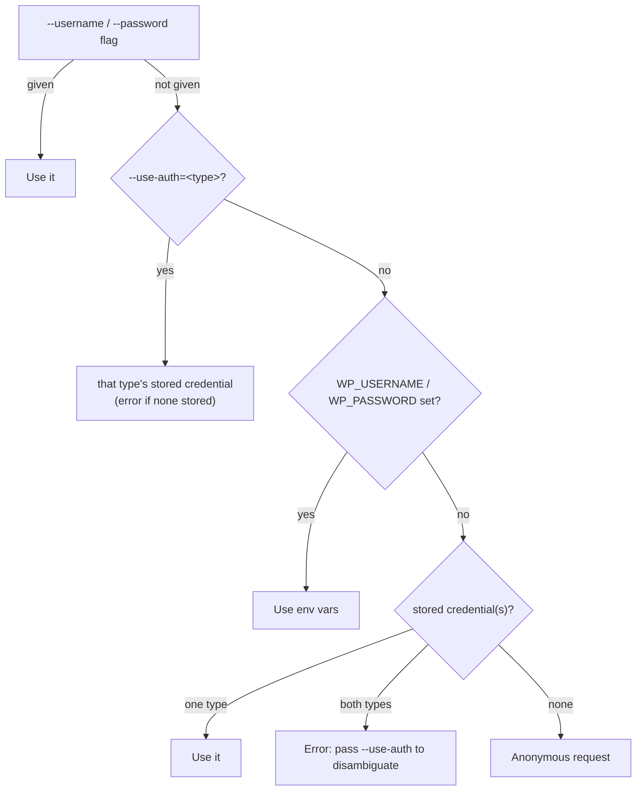

---
tags:
  - auth
---

# Authentication

`wrapido` supports two authentication mechanisms, on equal footing — `<type>` isn't optional flourish, it's how the CLI tells them apart, both in the command grammar (`wrapido auth <type> ...`) and in the same vocabulary WordPress (and any plugin it delegates to) itself uses: each type's name is the exact key the site's REST API root index reports that feature under in its `authentication` object. Run `wrapido --url=<site>` to see which ones a target site actually advertises.

<!-- markdownlint-disable MD046 -->

=== "Application Passwords"

    WordPress core's own mechanism (Users → Profile → Application Passwords, built in since 5.6) — revocable, scoped per-application, sent over the same HTTP Basic Auth the CLI always uses. **Start here if you're not sure which to use.**

    ```sh
    wrapido wp/v2 posts list \
      --url=https://example.com \
      --username=admin \
      --password="xxxx xxxx xxxx xxxx xxxx xxxx"
    ```

    Full details, including the browser-based `login` flow: [Application Passwords](authentication-application-passwords.md) (`application-passwords`).

=== "OAuth2"

    Via the [WP-API/OAuth2](https://github.com/WP-API/OAuth2) plugin, for a site that already runs it. Three ways in: the browser-based `authorization_code` grant, the no-browser `client_credentials` grant, or a personal access token generated by hand in wp-admin.

    ```sh
    wrapido wp/v2 posts list \
      --url=https://example.com \
      --use-auth=oauth2
    ```

    (assumes a credential was already stored with `wrapido auth oauth2 login`/`add` — see below.)

    Full details, including the wp-admin Application prerequisite: [OAuth2](authentication-oauth2.md) (`oauth2`).

<!-- markdownlint-enable MD046 -->

A site can have **both** an application-passwords and an oauth2 credential stored at once — see [Using a specific stored credential](#using-a-specific-stored-credential-use-auth) below for how that's disambiguated.

## Credentials via environment variables

<!-- markdownlint-disable-next-line MD046 -->
```sh
export WP_USERNAME=admin
export WP_PASSWORD="xxxx xxxx xxxx xxxx xxxx xxxx"

wrapido wp/v2 posts list --url=https://example.com
```

`WP_USERNAME`/`WP_PASSWORD` take precedence over a stored `wrapido auth` credential for the same site — if both are set, the env vars win on every command, silently, with no per-invocation indication that's happening. If that's not what you want (e.g. the env vars are left over from something else, or set globally in your shell), pin resolution to the stored credential with `--use-auth=application-passwords`:

<!-- markdownlint-disable-next-line MD046 -->
```sh
wrapido wp/v2 posts list --url=https://example.com --use-auth=application-passwords
```

`--use-auth` names a `wrapido auth` type (`application-passwords` or `oauth2`) rather than a generic "stored", since a site can have a credential of each type stored at once — it's the same value `wrapido auth <type> ...` uses, and errors immediately if nothing of that type is stored rather than silently falling through to anonymous. `--use-auth=env` is the mirror image (require the env vars, error if they're unset); `--use-auth=none` forces an anonymous request even if env vars or a stored credential exist. An explicit `--username`/`--password` flag still overrides everything, `--use-auth` included.

## Stored credentials (`wrapido auth`)

You can also store a credential per site, so it doesn't need to be repeated on every invocation for sites you use often. Every `wrapido auth` command takes an explicit `<type>` naming which authentication mechanism to use — see the [Application Passwords](authentication-application-passwords.md) and [OAuth2](authentication-oauth2.md) pages for each type's own `login`/`add`/`list`/`remove`/`use`/`status` commands.

Once stored, a site's credential is used automatically whenever you run a command against it without `--username`/`--password`. Precedence is: `--username`/`--password` flags; then, if `--use-auth` names a specific type (`application-passwords` or `oauth2`), that type's stored credential exactly (erroring if none is stored, rather than falling through); then `WP_USERNAME`/`WP_PASSWORD` env vars; then a stored `wrapido auth` credential for that site — if **both** an application-passwords and an oauth2 credential are stored and `--use-auth` wasn't given, this step is a fail-fast error naming both `--use-auth` values, rather than a silent guess (see below); then anonymous.

<!-- markdownlint-disable-next-line MD046 -->


!!! note "At-rest protection: a per-machine key file, not a secret vault"
    Stored credentials are encrypted on disk (via `conf`'s `encryptionKey`), using a random key generated once per machine and stored in its own file (`credential-key`, alongside the config file, restricted to the owner where the OS supports it) rather than a fixed key shipped in the CLI's source. That means a copied/leaked config file alone isn't enough to decrypt it — the separate key file is also needed. It does **not** protect against something that already has full read access to the same account (another process running as the same user, a compromised account, etc.) — that would need an OS keychain or secret manager, which is out of scope here. If a machine or its config is ever suspected compromised, use `wrapido config rotate-key` (rotates the local key, re-encrypting the existing store under it) and `wrapido auth application-passwords remove --all` (revokes what it can on each site, and forgets every stored credential) — see [Configuration](configuration.md).

## Using a specific stored credential (`--use-auth`)

Since a site can have both an application-passwords and an oauth2 credential stored, running an ordinary command with **neither** flags/env vars nor `--use-auth` given, and **both** types stored for that site, is an error rather than a silent guess:

<!-- markdownlint-disable-next-line MD046 -->
```sh
$ wrapido wp/v2 posts list --url=https://example.com
Error: Both an application-passwords and an oauth2 credential are stored for https://example.com —
pass --use-auth=application-passwords or --use-auth=oauth2 to disambiguate.

$ wrapido wp/v2 posts list --url=https://example.com --use-auth=oauth2
```

## How it's built

Auth is implemented behind a small `AuthProvider` interface — `BasicAuthProvider` (Application Passwords/plain passwords) and `OAuth2AuthProvider` (OAuth2 bearer tokens) today — so each mechanism stays independent of request-building code.

One level up, `wrapido auth <type> ...`'s own dispatch is built the same way: `AuthType` is a real TypeScript union, and `commands/auth.ts`'s top-level switch on it is exhaustively checked — adding a further type without a matching dispatch case is a compile error, not just a missed spot.
