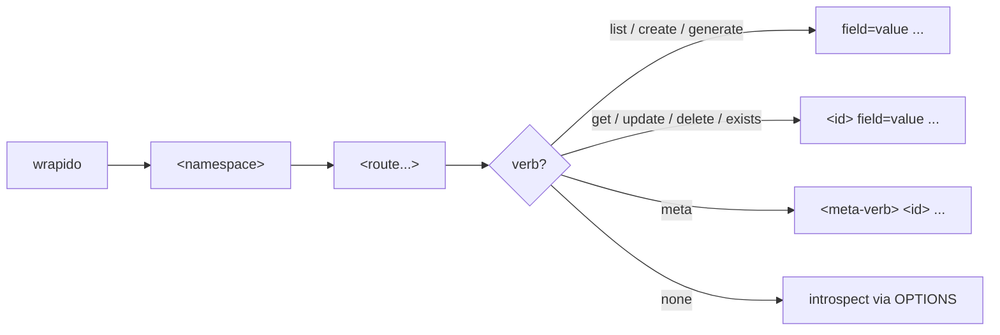

---
tags:
  - cli
  - routing
---

# Usage

## Command grammar

The whole CLI is one dynamic grammar built from whatever routes a site's REST API actually registers — there's no fixed command tree to memorize:

```text
wrapido                                                         # discover: list namespaces from the site's REST API index
wrapido <namespace>                                             # list routes registered under that namespace
wrapido <namespace> <route>                                     # introspect: show the route's supported methods/args/context (an OPTIONS request)
wrapido <namespace> <route> list        [--page=] [--per_page=] [...]   # --per_page=-1: every page
wrapido <namespace> <route> get <id>
wrapido <namespace> <route> create      [--field=value...] [--body=<json>]
wrapido <namespace> <route> update <id> [--field=value...] [--body=<json>]
wrapido <namespace> <route> delete <id> [--force]
wrapido <namespace> <route> exists <id>
wrapido <namespace> <route> generate    [--count=<n>] [--field=value...]
wrapido <namespace> <route> meta <add|clean-duplicates|delete|get|list|patch|pluck|update> ...
wrapido help [<namespace> [<route...> [<verb>]]]                # same shapes, but never performs the request
wrapido config get|set|clear
```

-   `list`/`create`/`generate` don't take an `<id>` — everything after the verb is treated as `field=value` pairs.
-   `get`/`update`/`delete`/`exists` require an `<id>` as the first token after the verb.
-   `exists` reuses `get`'s request shape but reports success/failure instead of printing the resource: exit code `0` if the id exists, `1` if it doesn't (a `404`).
-   Any failure — a bad flag, a live API error, a network problem — prints `Error: ...` (or, under `--format=json`/[agent mode](agent-mode.md), a JSON `{"error":{...}}` object) to **stderr** and exits `1`; stdout is left untouched. Success exits `0`.
-   `generate` isn't a single HTTP request — it loops `create` `--count` times, reusing the same fields for each item.
-   A route registered under nested literal path segments (e.g. a theme's `global-styles/themes/(?P<stylesheet>%s)`) is addressed as separate words, the same way WP-CLI addresses nested commands — e.g. `wrapido wp/v2 global-styles themes get <stylesheet>`.



## Routing

Most routes are a single segment with the parameter, if any, at the end (`posts get <id>`) — but the REST API registers some routes that don't fit that shape, and the CLI addresses all of them the same way it addresses a plain route: as words after the namespace.

**Mid-path parameters.** A route's placeholder isn't always at the end of its path — e.g. core's own `posts/(?P<parent>[\d]+)/revisions`. The CLI still finds it (`splitPlaceholder`/`paramIndex` in `core/indexer.ts`) and splices the id into the right spot instead of always appending it:

```sh
wrapido wp/v2 posts revisions get <parent-post-id>
```

A route with **two or more** placeholders (e.g. one specific revision of one specific post) needs values for all of them, typed in order after the route's own words — this only reaches plain introspection/`get`, since the CLI's grammar has just one `<id>` slot for every other verb.

**Hybrid routes.** A route can be both directly addressable *and* a container for further nested routes at once — e.g. `global-styles/themes` becomes hybrid once a `variations` child is registered beneath it. Introspecting a hybrid route shows its own schema plus a note listing the nested children, rather than one or the other. See [Help](help.md#listing-children) for how this renders.

**`types`/`taxonomies`/`statuses` are keyed, not paged.** These three routes return an object keyed by slug (`{post: {...}, page: {...}}`), not an array. `list` unpacks that into one row per entry via `Object.values(...)`, so `--fields`/`--format=ids`/etc. all still work — but they're never fetch-all candidates the way a normal paginated collection is; see [Pagination](pagination.md#preconditions).

**`create` follows its `Location` header.** A successful `create` returns whatever the `201` response's `Location` header points at (fetched with your `--context`), not the raw `POST` body — so the printed/returned resource is the canonical one, same-origin only.

**`generate` synthesizes missing fields.** `generate --count=<n>` loops `create` `n` times. Any field the route's schema marks `required` that you didn't supply gets an auto-generated value rather than failing outright; a couple of known-tricky endpoints (e.g. a required-but-hidden field WordPress itself doesn't declare, or `wp/v2/widgets`' `id_base`, discovered live from the sibling `widget-types` route) have extra recovery logic on top of the generic synthesis.

**Discovering a site's REST API root.** Given just `--url=<site>`, the CLI tries, in order, until one works: a `HEAD` request's `Link: <...>; rel="https://api.w.org/"` header, then the same on a `GET`, then an HTML `<link rel="https://api.w.org/">` tag in the page, then the conventional `/wp-json/` path, then `/?rest_route=/` (for sites without pretty permalinks). `--debug` logs which attempt succeeded.

**Error hints.** A local `CliError` or a live `WpApiError` prints a one-line `Error: ...`, and common REST error codes (`rest_forbidden`, `rest_no_route`, `rest_forbidden_context`, `rest_post_invalid_id`, `rest_invalid_param`, the `rest_upload_*` family, any `rest_cannot_*` code) get a human-readable hint appended beneath it — a hint can also be set per-error by the code that raised it (used by `generate`'s recovery path to explain exactly why a field couldn't be synthesized).

**Ctrl-C during a progress bar.** Interrupting a `list --per_page=-1`, `generate`, or upload mid-flight (a progress bar or spinner is on screen) stops it cleanly and exits with code `130`, instead of leaving the terminal's line-wrapping disabled.

## Global flags

| Flag                                                  | YAML key       | Description                                                                                                                                                                                                                                                                                                                                                                                        |
| ----------------------------------------------------- | -------------- | -------------------------------------------------------------------------------------------------------------------------------------------------------------------------------------------------------------------------------------------------------------------------------------------------------------------------------------------------------------------------------------------------- |
| `--url=<site>`                                        | `url`          | WordPress site URL. Required unless a default is saved (`wrapido config set --url=`) or set in a config file.                                                                                                                                                                                                                                                                                      |
| `--username=<user>`                                   | —              | Also via the `WP_USERNAME` env var. Not allowed in config files.                                                                                                                                                                                                                                                                                                                                   |
| `--password=<pass>`                                   | —              | Also via the `WP_PASSWORD` env var. A WordPress **Application Password** is strongly recommended over a real account password — see [Authentication](authentication.md). Not allowed in config files.                                                                                                                                                                                              |
| `--client-id=<id>` / `--client-secret=<secret>`       | —              | OAuth2 credential, for `wrapido auth oauth2 login`/`add` — see [OAuth2](authentication-oauth2.md). Not allowed in config files.                                                                                                                                                                                                                                                                    |
| `--token=<token>`                                     | —              | OAuth2 personal access token, for `wrapido auth oauth2 add`. Not allowed in config files.                                                                                                                                                                                                                                                                                                          |
| `--use-auth=env\|none\|application-passwords\|oauth2` | `use-auth`     | Pin credential resolution to one source, skipping the rest of the fallback chain — see [Authentication](authentication.md).                                                                                                                                                                                                                                                                        |
| `--context=view\|edit\|embed`                         | `context`      | Default `view`. Run `wrapido <namespace> <route>` to see which values a given route actually supports.                                                                                                                                                                                                                                                                                             |
| `--format=table\|json\|csv\|yaml\|ids\|count\|raw`    | `format`       | Default `table`. Table cells are truncated per `--truncate-length` (a nested object/array cell shows its JSON, truncated the same way but ending in `...}`/`...]`), unless named via `--fields` (e.g. `--fields=title.rendered`). `count` prints the site total from the `X-WP-Total` response header when WordPress sends one, else the number of rows returned.                                  |
| `--fields=<a,b,c>`                                    | —              | Limit output to specific fields (table/csv also accept dotted paths like `title.rendered`). Per-invocation only. Also sent to the API as `_fields` (except on `delete`) to trim the response, and still filtered locally for endpoints that ignore it.                                                                                                                                             |
| `--field=<name>`                                      | —              | Print a single field's raw value (supports dotted paths, e.g. `title.rendered`). Per-invocation only.                                                                                                                                                                                                                                                                                              |
| `--body=<json>`                                       | —              | Raw JSON request body for `create`/`update`, overriding/merged under `--field=` args. Per-invocation only.                                                                                                                                                                                                                                                                                         |
| `--timeout=<ms>`                                      | `timeout`      | Timeout for every HTTP request; when given it replaces all the defaults below. Defaults: 20000 (20 s) for API calls, 8000 for site discovery and `wrapido auth` calls, and 300000 (5 min) for file uploads/downloads, where it is an idle timeout that resets whenever data moves.                                                                                                                 |
| `--no-color`                                          | `color: false` | Disable colored output. Also off when `NO_COLOR` is set or agent mode is on.                                                                                                                                                                                                                                                                                                                       |
| `--no-pager`                                          | `pager: false` | Never page output, even at a terminal. See [Paging output](configuration.md#paging-output).                                                                                                                                                                                                                                                                                                        |
| `--truncate-length=<n>`                               | —              | Max characters a table cell shows before truncating; default 50. `0` shows full values. Per-invocation only.                                                                                                                                                                                                                                                                                       |
| `--quiet`                                             | `quiet`        | Suppress spinners.                                                                                                                                                                                                                                                                                                                                                                                 |
| `--debug`                                             | `debug`        | Print a stack trace on unexpected (non-API) errors, and log every HTTP request/response to stderr plus the config files loaded and which site-discovery attempt succeeded (see [Routing](#routing)). Redacted before logging: the `Authorization`/cookie/`x-wp-nonce`/`x-api-key` headers, and `password`/`client_secret`/`code`/`access_token`/`refresh_token` body fields. API requests add `?_envelope=true` so WordPress returns its response headers (`X-WP-Total`, plugin headers such as Query Monitor's `X-QM-*`, ...), which are logged too; the body is unwrapped and output is unchanged. |
| `-h`, `--help`                                        | —              | Show help for the given namespace/route/verb, or the top-level help.                                                                                                                                                                                                                                                                                                                               |

Flags with a YAML key can be set in a [config file](configuration.md#yaml-config-files); a flag on the command line always wins.

Any other `--name=value` (or bare `--name`, treated as `--name=true`) is passed straight through as a WordPress REST API field or query argument — e.g. `--per_page=5`, `--title="Hello"`, `--force`. Run `wrapido <namespace> <route>` first to see exactly which ones a route accepts.

`list --per_page=-1` fetches **every** page — see [Pagination](pagination.md) for the full algorithm (parallel batching, the `Link`-header fallback, `--format=count`'s shortcut, and which routes it doesn't apply to).

## Agent mode

Auto-detected inside Claude Code, OpenAI Codex, GitHub Copilot's agent tooling, Cline and Cursor (or set `WRAPIDO_AGENT=1` by hand): plain, machine-friendly output (JSON by default, no colour or spinners, JSON errors, unknown-flag warnings) without changing anything for interactive use. See [Agent mode](agent-mode.md).

## Paging

Any command's output pages through `less` (or `$PAGER`) automatically at a real terminal — see [Paging output](configuration.md#paging-output).

## TLS certificates

The CLI does **not** verify HTTPS certificates, so sites with self-signed, expired or mismatched certificates (local and staging installs) work without extra flags. This applies to every request, including uploads and downloads. Because the server's identity isn't checked, avoid using it with real credentials over untrusted networks.

## Help

`wrapido help [<namespace> [<route...> [<verb>]]]` renders the same usage synopsis you'd see interactively, built dynamically from the site's live introspected schema, but never performs the underlying request. See [Help](help.md) for the full page, including the WP-CLI-style `--help` output.

## Uploading files

Mark a value with `@` to upload it, using the parameter name the endpoint expects: `wrapido wp/v2 media create --file=./cat.jpg`. See [Uploading files](uploading-files.md).
